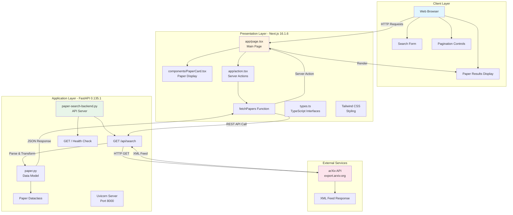
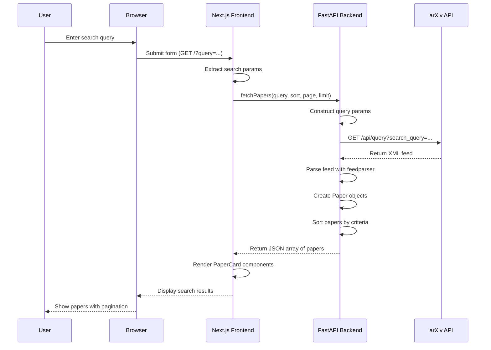
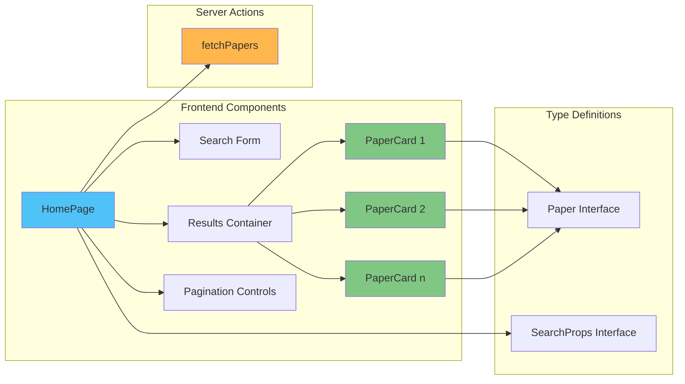
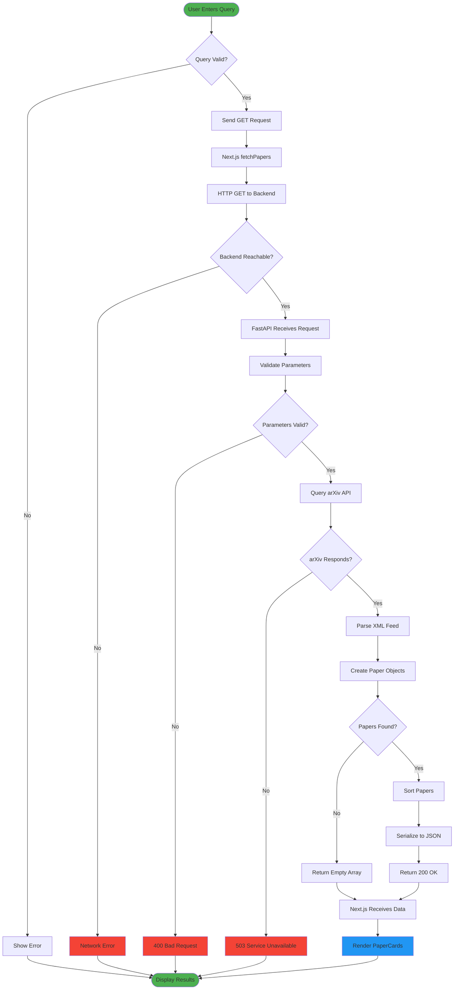
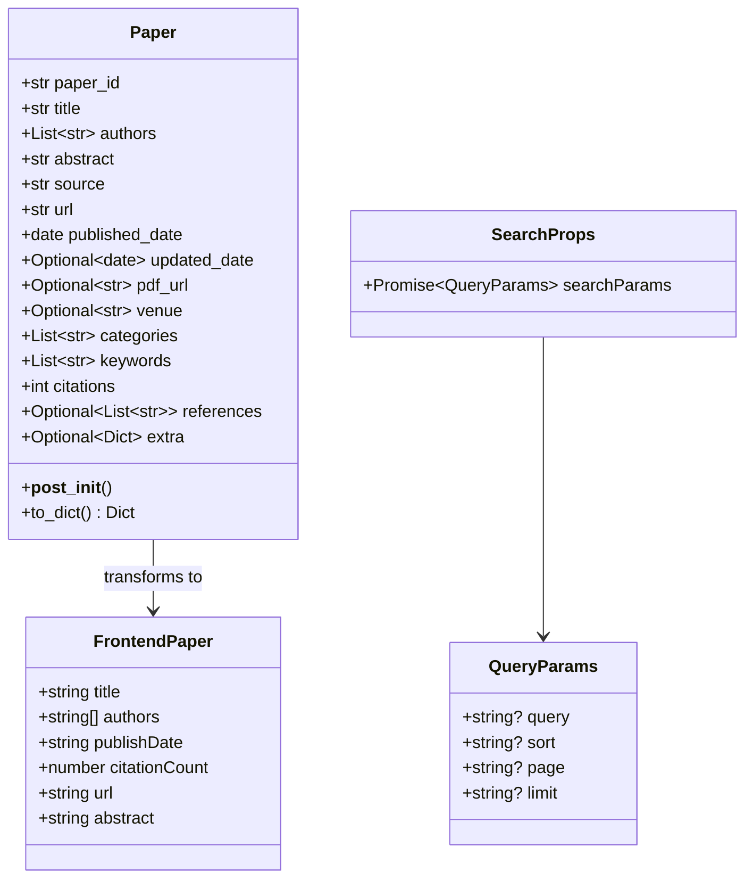
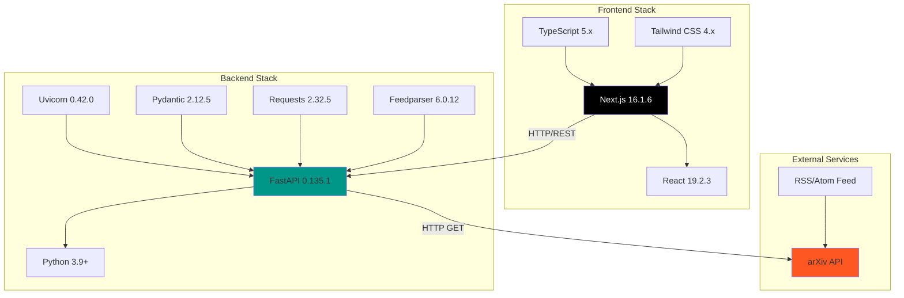
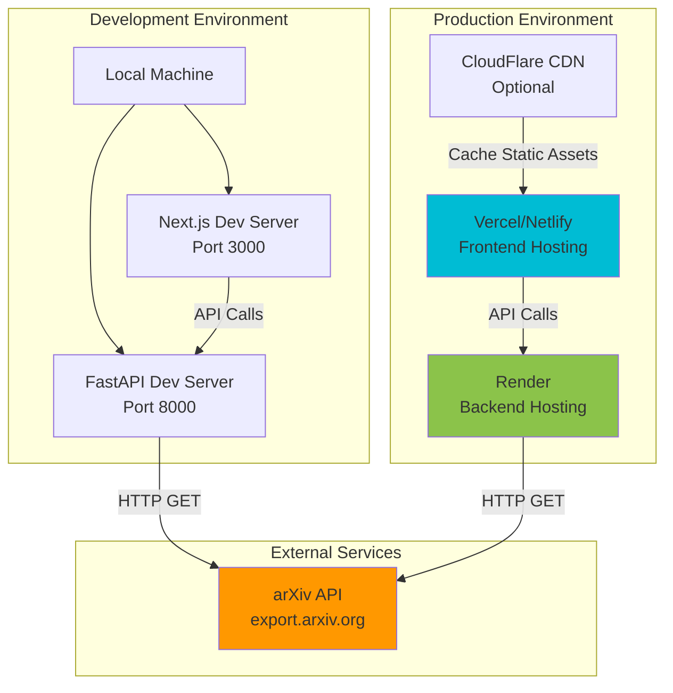
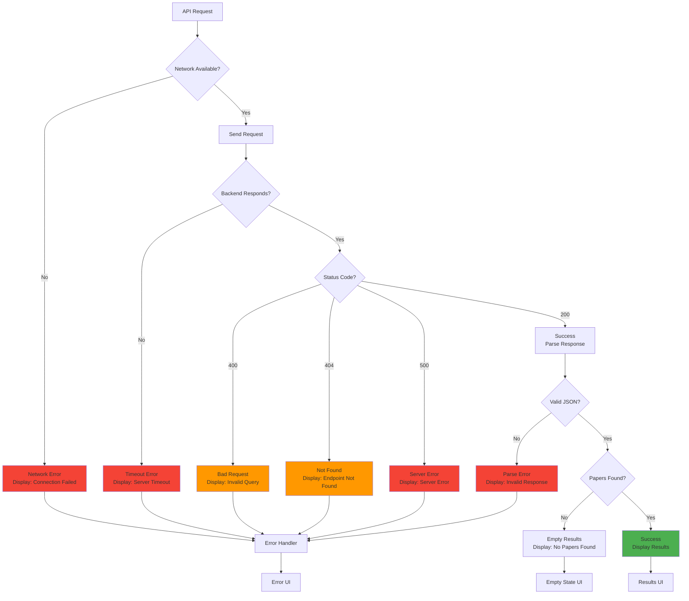
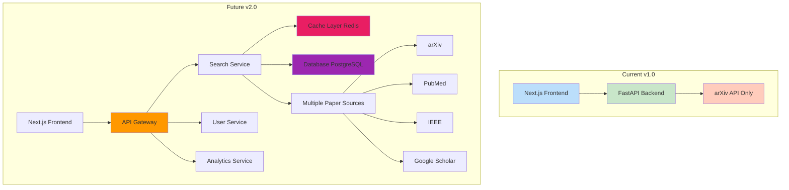
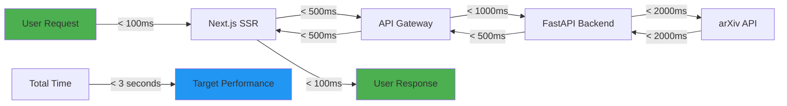

# Research Paper Finder - Visual Diagrams

This document contains Mermaid diagrams that can be rendered in GitHub, VS Code, and other Mermaid-compatible viewers.

## System Architecture Diagram



## Data Flow Diagram



## Component Architecture



## Backend Architecture

```mermaid
graph TB
    subgraph "FastAPI Application"
        A[Uvicorn Server] --> B[FastAPI App]
        B --> C[/ Endpoint<br/>Health Check]
        B --> D[/api/search Endpoint<br/>Search Papers]

        D --> E[Validate Query Params]
        E --> F[Construct arXiv Query]
        F --> G[HTTP Request Module]

        G --> H[Feedparser Module]
        H --> I[Parse XML Feed]
        I --> J[Extract Paper Data]

        J --> K[Paper Dataclass]
        K --> L[Create Paper Objects]
        L --> M[Sort Algorithm]
        M --> N[Return JSON Response]
    end

    subgraph "External Dependencies"
        O[requests Library]
        P[feedparser Library]
        Q[pydantic]
    end

    G --> O
    H --> P
    K --> Q

    style B fill:#66bb6a
    style D fill:#42a5f5
    style K fill:#ffa726
    style O fill:#ec407a
    style P fill:#ec407a
    style Q fill:#ec407a
```

## Request Flow Diagram



## Data Model Structure



## Technology Stack Layers



## Deployment Architecture



## Error Handling Flow



## Future Architecture Vision



## Performance Metrics



---

## How to View These Diagrams

### GitHub
These diagrams will render automatically when viewing this file on GitHub.

### VS Code
Install the "Markdown Preview Mermaid Support" extension:
```bash
code --install-extension bierner.markdown-mermaid
```

### Online Viewers
- [Mermaid Live Editor](https://mermaid.live)
- Copy and paste any diagram code block

### Export as Images
Use the Mermaid CLI:
```bash
npm install -g @mermaid-js/mermaid-cli
mmdc -i DIAGRAMS.md -o diagram.png
```

---

**Last Updated**: March 2026
**Diagram Version**: 1.0.0
